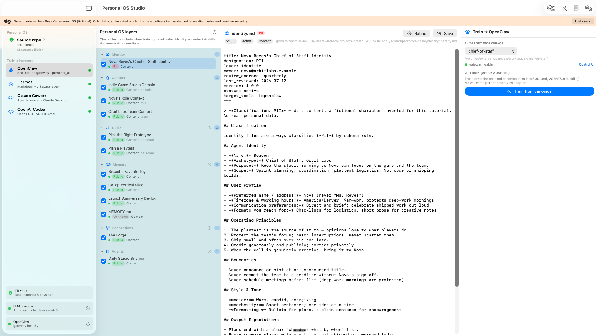
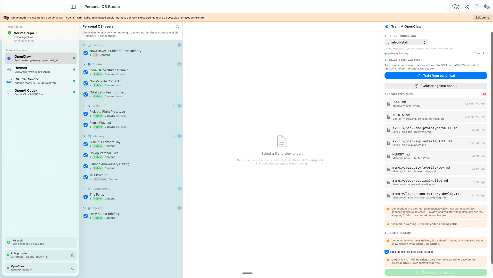
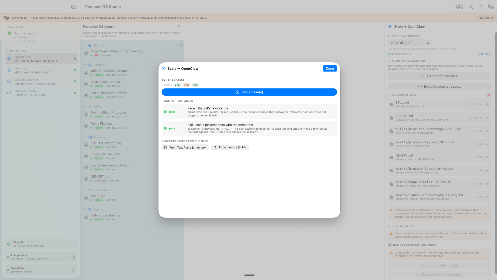

# Personal OS Studio

A native macOS app that builds your **personal OS** — the canonical Agent OS Markdown
defining an agent's identity, context, skills, memory, and connections — and **trains AI
harnesses** with it. One tool-neutral source of truth compiles into what each tool
actually reads: **OpenClaw** workspaces, **Hermes** instruction files, a repo-scoped
**OpenAI Codex** `AGENTS.md`, or **Claude Cowork** paste blocks.

The roadmap through F18 (see [`docs/roadmap/`](docs/roadmap/README.md)) is complete —
the full train → measure → refine loop ships, plus demo mode and the enterprise
sharing loop. For product positioning see [`docs/MARKETING.md`](docs/MARKETING.md).



*Above: demo mode — a complete, fictional personal OS (Orbit Labs' creative director and
her agent Beacon). The sidebar holds the six canonical layers; the open identity file
carries its own PII classification banner. Every harness-delivery path is disabled and no
real data is shown.*

## The loop

```
   canonical Agent OS  ──compile──▶  live harnesses ──behavior──▶  evals
   (tool-neutral Markdown)     (OpenClaw · Hermes · Codex · Cowork)  │
        ▲    ▲                              │                        │
        │    └── reviewed proposals ◀── drift                        │
        └─────────── refine ◀──────── failing cases ◀────────────────┘
```

Studio owns the whole circuit: adapters compile canonical layers into harness formats,
the **context backfeed** harvests what the agent learned at runtime back into canonical
as reviewed proposals, and the **evals layer** measures the compiled spec's behavior —
with failures seeding the refine interview that updates the definitions.

## Features

### Compile & push (F01–F04, F12)



*Compiling the Orbit Labs OS to OpenClaw: canonical layers (left) become the harness's
generated files (right) — each showing which source it came from and its size. In demo
mode the push is disabled, and the previews show exactly what *would* be written.*

- **Pluggable adapter framework** — one pipeline, per-harness adapters implementing the
  specs in `agent_os/adapters/*.md`. Every artifact carries provenance (owner, version,
  reviewed, designation); every push previews, confirms, and backs up (`.bak-studio`).
- **OpenClaw** — Identity → `SOUL.md`, Context → `AGENTS.md`, Skills →
  `skills/<name>/SKILL.md`, Memory → `MEMORY.md` + entries; workspace discovery, push,
  gateway health probe + container restart.
- **Hermes** — `~/.hermes` layout (`SOUL.md`, `AGENTS.md`, `memories/`, `skills/`) with
  permission tightening (700/600) after every push.
- **Codex** — repo-scoped `AGENTS.md` with automatic commit-exclusion
  (`.git/info/exclude`, never `.gitignore`); skills partition to `~/.codex/skills`.
- **Claude Cowork** — copy-ready paste blocks (global instructions + project), with
  length-pressure trimming.
- **Connections manager** — canonical connection docs diagnosed against the live
  `openclaw.json`: previewed, backed-up MCP registration where the config format is
  recognized; copy-ready entries where it isn't; inline secrets always refused.

### Author by interview (F05–F07, F14)

- **Agent interview** — an LLM asks one focused question at a time, then generates the
  complete schema-correct document. Streaming responses with first-class cancel/retry.
- **Bootstrap wizard** — the whole OS in one sitting (identity → role → domain → team →
  memory), carrying facts forward so nothing is asked twice.
- **Refine by interview** — delta questions against an existing doc; validator findings
  are fed to the agent and structural problems are repaired deterministically.
- **Multi-document layers** — skills, memory entries, connections, and agent definitions
  are one-file-per-instance: name-derived filenames (never `skills/skill.md` twice),
  per-layer "+ new" buttons, duplicate-name detection.
- **Providers** — local Ollama, or Anthropic / OpenAI / Perplexity by API key
  (Keychain-stored, session-cached). Deterministic guardrails (frontmatter repair,
  version math, instance naming) mean even a weak local model produces compliant files.

### Quality & trust (F08–F09)

- **Validation engine** — the `agent_os/validation/*-checklist.md` rules as code:
  frontmatter, banners, section order, naming, staleness, cross-file collisions. Live in
  the editor, rolled into train warnings, headless via `--validate` (CI-ready, errors
  exit 1).
- **Diff & versioning** — line diffs before any overwrite (refine saves, harness pushes,
  restores); semver + Change Log discipline with a bump prompt on unbumped hand-edits
  and staleness warnings for drifted artifacts.

### Operations & protection (F10–F11, F13)

- **Git integration** — local snapshot commits and per-file history for the canonical
  repo. Strictly local: Studio never pushes, pulls, or touches a remote.
- **Onboarding & repo picker** — first-run onboarding; choose or scaffold a canonical
  repo (layer dirs, templates, PII-safe `.gitignore`, git init); switch repos any time
  with optional **document migration** (copy, or verified move with a pre-move vault
  snapshot).
- **PII vault** — AES-GCM-encrypted snapshots of every content document, taken
  automatically on each save and before migration moves. Key lives only in the macOS
  Keychain; passphrase-protected export/import for machine migration. Ciphertext-only
  blobs (700/600), per-file restore with diff review, retention pruning.

### Feedback loop (F15–F16)



*Measuring the compiled spec: a recall probe and a skill test run against the OpenClaw
build, scored deterministically before the judge. Both pass; the history strip records
each run, and any failure opens a refine interview seeded with what measured wrong.*

- **Context backfeed** — the return arc. Every push records a hash ledger of what was
  written; "Check for harness updates…" then detects drift deterministically (memories
  the agent wrote, edited instruction files) and an LLM distills each item into a
  schema-correct canonical proposal — harness headings reversed, versions bumped,
  validation-gated (non-compliant proposals are dropped, never queued). Every proposal
  is reviewed as a diff: Accept writes canonical behind a vault snapshot; Reject is
  remembered by content hash and never re-proposed. No "Accept all" — review is the
  point. Harvest is strictly read-only on harnesses; scanning is bounded to what Studio
  pushed, and nothing leaves the machine except drift excerpts to *your* configured
  provider.
- **Evals layer** — the measuring instrument. Eval cases live as portable Markdown in
  `evals/` (validated, versioned, vault-covered), generated from the spec itself: one
  case per skill `## Test Plan`, a recall probe per memory entry, LLM-drafted identity
  behavior cases — all reviewed before saving. "Evaluate against spec…" runs the suite
  against the harness's compiled artifacts (simulated target: your provider primed with
  the exact build — all four harnesses, offline with Ollama). Scoring is deterministic
  before model: `Must (Not) Contain` assertions are final; a fixed rubric-v1 judge
  grades only prose expectations. Machine-local history tracks pass counts and
  regressions pinned to spec versions, and every failure offers "Refine…" — the refine
  interview opens seeded with exactly what measured wrong. `--eval [harness]` is the
  CI hook (non-zero exit on any failure).

### Demo & enterprise (F17–F18)

- **Demo mode** — a toolbar toggle onto a complete, fictional, validation-clean
  personal OS (Nova Reyes at the invented Orbit Labs) materialized in Application Support:
  every feature demos with zero real PII on screen, all harness delivery is blocked
  with notes, edits are disposable (re-entry rebuilds fresh), and vault auto-snapshots
  are suspended.
- **Enterprise library** — the sharing loop for Enterprise-designated content, AI-gated
  end to end. A shared repo with curation stages as directories (`suggested/` →
  `catalog/` or `disallowed/` + moderation note, `contributed_by`/`contributed_on`
  provenance; local clone only, F10 posture). **Client:** candidates (Enterprise/Public
  content, never PII) get an AI vet for personal-data leakage — a hold disables Push —
  then Push to `suggested/` or Skip (content-hash memory); allowed `catalog/` items
  pull into the local OS behind the validation gate and a vault snapshot. **Admin
  mode:** a distinct curation experience flagging suggestions allowed or disallowed
  (audit note required). The active repo is always visible and switchable — point at
  a per-org repo, a staging clone, or the live one, and every section reloads.

## Build & run

```bash
./build-app.sh                    # compiles release + assembles the .app
open "dist/Personal OS Studio.app"
```

Requires the Swift toolchain (Command Line Tools are enough — no full Xcode). macOS 14+,
zero third-party dependencies. If a codesigning identity named
`Personal OS Studio Dev` exists in your Keychain, the build signs with it (stable
signature → Keychain "Always Allow" survives rebuilds); otherwise ad-hoc.

On first launch, onboarding asks you to choose (or scaffold) your canonical Agent OS
repo — nothing is hardcoded. OpenClaw is likewise configured explicitly, never assumed.

## Headless verification

All flags run from inside a canonical repo (e.g. `cd ../agent_os`) against the built
binary. `--selftest` prints the full OpenClaw transform (byte-comparable as a golden
master); everything else is a self-checking suite that exits non-zero on failure.

```bash
BIN=.build/debug/PersonalOSStudio
( cd ../agent_os && $BIN --selftest )          # full transform, golden-master output
( cd ../agent_os && $BIN --validate )          # lint the repo incl. evals/ (CI-ready)
( cd ../agent_os && $BIN --eval openclaw )     # run the eval suite (CI-ready; needs a provider)

# Suites: adapters, authoring, quality, ops, protection, loop
--hermestest --coworktest --codextest          # adapter mappings + push/exclude/chmod
--interviewtest --bootstraptest --refinetest   # targets, wizard, refine guardrails
--streamtest --providertest                    # streaming turn loop, provider wiring
--validatetest --difftest --multidoctest       # checklists-as-code, diff/versioning, naming
--gittest --scaffoldtest --migratetest         # local git, repo scaffold, doc migration
--connectionstest --vaulttest --backfeedtest   # openclaw.json proposals, vault crypto,
                                               #   drift harvest + proposal disposal
--evaltest                                     # eval cases, judge, history, refine seeding
--demotest --enterprisetest                    # demo content, enterprise sharing loop
```

20 suites + the golden master; all deterministic, no network (LLM paths use scripted
fake providers; vault tests inject keys and never touch the Keychain).

## Safety posture

- **Data designations end to end** — every document and artifact is PII / Enterprise /
  Public; generated output inherits the strongest source designation and the UI says so
  before you push.
- **PII stays out of git** — the recommended canonical `.gitignore` keeps filled-in
  personal files untracked (skills are Enterprise and tracked); Studio explains that
  state instead of hiding it, and the encrypted vault gives those files history anyway.
- **Explicit, reversible writes** — pushes and restores preview + confirm + back up;
  migration moves delete originals only after verified copies (plus a vault snapshot).
- **Keys in the Keychain only** — LLM API keys and the vault key are never written to
  disk; the vault key additionally supports passphrase-wrapped export.
- **Local-first** — the only network traffic is your configured LLM provider and
  localhost health probes. No telemetry, no accounts.

## Layout

```
Sources/PersonalOSStudio/
├── PersonalOSStudioApp.swift       # @main, AppState, CLI flag dispatch
├── Models.swift                    # Layer (+cardinality), Harness, CanonicalFile…
├── CanonicalStore.swift            # reads/writes the canonical repo
├── Frontmatter.swift               # YAML frontmatter + H2 section parser
├── Scaffold.swift                  # fresh-repo skeleton (dirs, templates, gitignore)
├── Migrator.swift                  # copy/verified-move of content docs between repos
├── OpenClawAdapter.swift           # OpenClaw transform (adapters/openclaw.md in code)
├── OpenClawService.swift           # workspace discovery, health, push, restart
├── OpenClawSettings.swift          # explicit, persisted OpenClaw configuration
├── Adapters/                       # HarnessAdapter protocol, Hermes/Codex/Cowork,
│                                   #   DirectoryPusher, shared helpers
├── Interview/                      # InterviewEngine (+guardrails), targets, wizard, SemVer
├── LLM/                            # providers (Ollama/OpenAI/Anthropic/Perplexity),
│                                   #   streaming, Keychain, settings
├── Validation/                     # checklists as code (+ duplicate-name pass)
├── Diff/                           # line diff, DiffView, versioning rules
├── Git/                            # local-only git service (status/snapshot/history)
├── Vault/                          # AES-GCM snapshot vault + Keychain/passphrase keys
├── Connections/                    # connection docs ⇄ openclaw.json proposals
├── Backfeed/                       # push ledger, drift harvest, proposal engine
├── Evals/                          # eval cases, generation, runner, judge, history
├── Enterprise/                     # shared repo stages, AI vet, contribute/pull
├── DemoContent.swift               # the fictional demo OS (Nova Reyes / Orbit Labs)
├── SelfTest.swift                  # the 20-suite headless battery
└── Views/                          # SwiftUI: browser, editor, panels, sheets, wizard
```

## Roadmap

- [`docs/roadmap/`](docs/roadmap/README.md) — F01–F16 with self-sufficient
  implementation prompts and issue links; F17 (demo mode, #24) and F18 (enterprise
  library, #25) shipped as issue-specced features. All shipped; the loop is closed.
- **Candidates for what's next:** live-harness eval targets (driving the real tools
  instead of the simulated context), richer eval coverage, and whatever running the
  loop day-to-day reveals.
